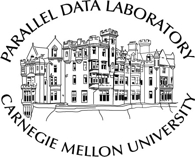

# Souptik Sen  
Graduate Student (MS)  
Parallel Data Lab  
University of California, Santa Cruz  

<em>Email: </em><a href="mailto:souptiksen@cmu.edu">souptiksen@cmu.edu</a>  
<em>Mailing address:  </em>Information Networking Institute  Carnegie Mellon University  5000 Forbes Avenue Pittsburgh, PA 15213  
<!-- 
<a href="http://doodle.com/dhawaljoh" target="_blank">Meet me!</a> | <a href="http://flask.io/yoUm1" target="_blank">Assign me a task!</a> (please let me know you've added something!)
 -->

## About Me

<!--  -->

I am Graduate student, working with <a href="http://www.andrew.cmu.edu/user/gaurij/" target="_blank">Prof. Gauri Joshi</a> in the <a href="http://www.andrew.cmu.edu/user/gaurij/Research.html" target="_blank">Distributed Machine Learning</a> project at <a href="http://www.pdl.cmu.edu/" target="_blank">Parallel Data Lab</a>. In 2017, I spent at awesome summer at LinkedIn working with the <a href="https://engineering.linkedin.com/teams/data" target="_blank">Data team</a>. I graduated from <em><a class="tosu" href="https://bitmesra.ac.in/" target="_blank">Birla Institute of Technology</a></em>in 2013, followed by a brief stint as a Software Engineer at <em><a class="tosu" href="https://www.ca.com/us.html" target="_blank">CA Technologies</a></em> in Hyderabad and Toronto.

## Research Interests

Broadly, my interests lie in problems relating to Big Data, Large scale Machine Learning and Distributed Systems. My current research on optimizing the performance of Large scale Machine Learning systems, where training is performed by running stochastic gradient descent (SGD) in a distributed fashion using a central parameter server and multiple servers (learners). Synchronization delays due to straggling learners can significantly increase the run-time of the training job. We working on new algorithms that try to mitigate straggler effects in Synchronous SGD, whilst keeping a decent gradient quality and convergence time. Along with that we are also working on delayed gradient accumulation to reduce communication overhead in Distributed Synchronous SGD.  

In Summer 2017, I was a Software Engineering intern with LinkedIn's Big Data team, where I wrote a data tooling library in Scala for query translation from Hive to Spark. 

## Updates

<table style="white-space: nowrap;">

    <tr>
    <td width="75"><b>New!</b></td>
    <td>Summer 2018 at Parallel Data Lab, working on <a href="http://www.andrew.cmu.edu/user/gaurij/Research.html" target="_blank">Distributed Machine Learning</a></td>
    </tr>

    <tr>
    <td width="75"><b>Spring, 2018</b></td>
    <td>Research Assistant at <a href="http://www.andrew.cmu.edu/user/gaurij/Group.html" target="_blank">Prof. Gauri Joshi's group</a> at the Parallel Data Lab.</td>
    </tr>

    <tr>
    <td width="75"><b>Fall, 2017</b></td>
    <td>Teaching Assistant for <a href="https://www.cs.cmu.edu/~jianma/15351/index.html" target="_blank">Algorthms and Advanced Data Structures</a> offered by <a href="https://www.cs.cmu.edu/" target="_blank">CMU's CS dept.</a></td>
    </tr>

    <tr>
    <td><b>Summer 2017</b></td>
    <td>Software Engineer Intern with <a href="https://engineering.linkedin.com/teams/data" target="_blank">LinkedIn's Data team</a> in Sunnyvale, CA.</td>
    </tr>
</table>